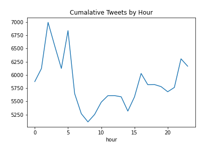
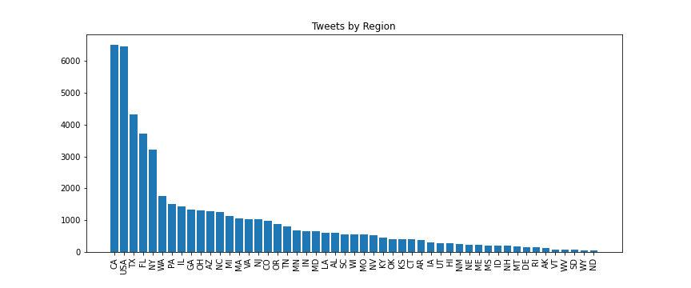
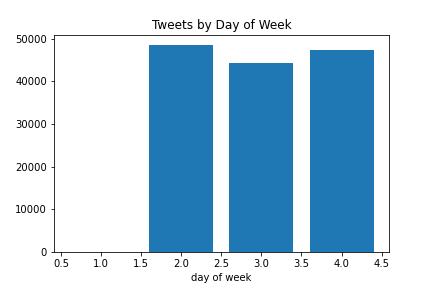
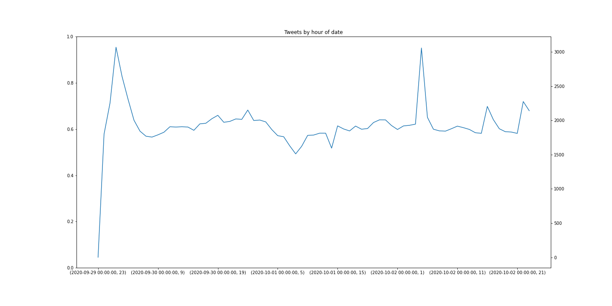

# poller_opposites_election_hackathon

## Business Understanding

The first presidential debate of the 2020 U.S. election was held on September 29, 2020. In the three days following this Tuesday event, the American public learned that President Donald J. Trump had tested positive for coronavirus at some point in temporal proximity to the debate. In this project, we tasked ourselves with analyzing the sentiments at play towards both candidates, Trump and Biden, during the period of time that the public was processing this new information.

**Essential question**: Can we accurately discern pro-Biden or pro-Trump sentiment from a tweet simply based on its contents?

## Data Understanding

We used the dataset available at link to full data set: <>

This dataset had 386 million Tweets, starting from May 20, 2019. The contributors leveraged the Twitter API to follow specified accounts that mentioned specific keywords.

* Data Source: [GitHub Repo link provided @12PM Friday 10/29/2020]
* Clone [GitHub Repo link provided @12PM Friday 10/29/2020]
* Follow the instructions in the repository to install twarc and tqdm.
* Apply for a twitter developer account.
* Save api key, save api secret key, save bearer token.
* Enter your twitter api information into twarc.
* Use a mv command to move the contents of the desired days into a new single directory.
* Look inside the cloned repository for the appropriate .txt files containing tweet ids. (ex. cat * >> file name.txt)
* Concatenate those files into one file.
* In the terminal, use awk 'NR % 100 == 0' <file.txt> > <result.txt> to systematically sample every 100th tweet id. These are the tweets you will hydrate.
* Modify the hydrate.py script in the cloned repository and run the script to rehydrate tweets from your file of tweet ids.
* Analyze tweets.

<INSERT MORE INFO ABOUT DATASET HERE>

**How many tweets did we use in training/test sets?
Did we stratify?
How many unique users?**

Because the provided Twitter data was inherently messy, our first step was to clean the provided JSONL file to conduct exploratory data analysis (EDA).

To replicate our process:
1) [Data import + cleaning](/notebooks/Cleaner.ipynb)
2) [EDA](notebooks/eda.ipynb)
3) K-Means Clustering
4) NLP analysis to create bag of words
5) Modeling
6) Predictions

## Data Preparation

This plot shows the distribution of tweets over hours of the three days included in our data sample. There are peaks in election-related tweets at 3 AM and 5 AM. **WHAT TIME ZONE IS THIS?!**

This plot shows the distribution of tweets by location, broken down by state and in comparison to tweets generally sent from the US. CA and non-state-specific USA contributed the most Trump-/Biden-related tweets over this three-day period.

## Modeling

After applying sentiment analysis through the VaderSentiment library, we assigned a sentiment score ranging from -1 to 1 to each cleaned tweet.

After doing so, we filtered tweets into three categories:
1. mentions **Trump**
2. mentions **Biden**
3. mentions **Trump AND Biden**

Setting sentiment scores as the following:
- sentiment <0 indicates **negative** sentiment
- sentiment >0 indicates **positive** sentiment
- sentiment = 0 indicates **neutral** sentiment

The results were: 
||Trump|Biden|Trump + Biden|
|------|------|------|------|
|**Postive**|26766|8890|4374|
|**Negative**|21894|7848|6111|
|**Neutral**|19541|6650|4025|

## Evaluation

## Deployment

Future steps:
1) Create a tweet sentiment analysis chat bot that solicits which keywords the user wants to analyze and how many tweets to be pulled from the Twitter API
2) Implement the chat bot into a Flask or web-based app
